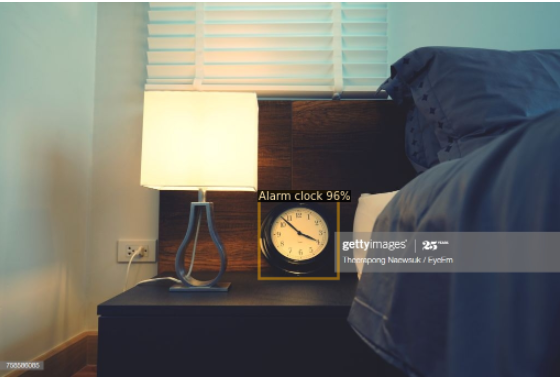
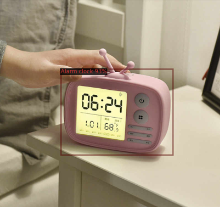

<h1>Objective</h1> 
This is a simple object detection model which could able to detect namely two objects i.e Alarm clock and Television.

<h1>Description</h1>
Detectron2 is a ground-up rewrite of Detectron that started with maskrcnn-benchmark.The platform is now implemented in PyTorch.
I have used Faster RCNN model and fine tunned it to produce classification on two objects i.e Alarm Clock and Television.
The dataset consits of 400 images in the training set and 30 images for validation. The images are downloaded from Google open images.

<h1>Result</h1>
In the end the model is able to detect the objects successfully with high confidence.

